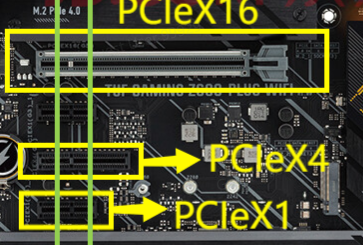
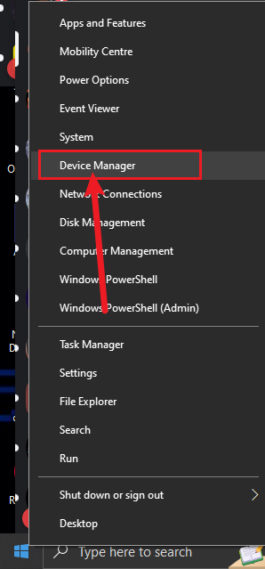
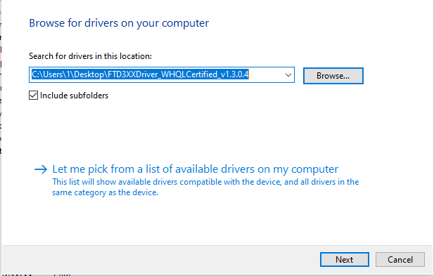

# Setup Instruction


**Completely Power Off Main PC**

Before installing DMA, you must power off the PC and disconnect the power. Inserting or removing DMA while the power is on may damage the DMA board.



**About Kill Switch**

For DMA devices with a built-in switch, turning it on and off must be done while the PC is turned off. Turning the DMA switch on or off while the PC is powered on can easily damage the DMA.



**Prioritize choosing a USB 3.0 port > USB Type-C**

Prioritize choosing a USB 3.0 port. If not available, consider purchasing a Type-C to USB 3.0 (blue port) adapter. Otherwise, the speed measurement rate might be affected.



**Download & Install VC Runtime Library & DirectX Runtime Library**

VC Runtime All in One Pack -> [TechPowerUp](https://www.techpowerup.com/download/visual-c-redistributable-runtime-package-all-in-one/)\
DirectX Runtime -> [Microsoft](https://www.microsoft.com/en-us/download/details.aspx?id=35)


***

## » Preparation

1. Install DMA board to PCIE Slots as image below.

<figure><figcaption></figcaption></figure>


PCIe x16, x4 and x1 is supported.


2. Fix the DMA to the casing using the screws, refer to the fixing method of the graphics card.
3. Connect the DMA (Data Port) to the second pc. Preferred plug into USB3.1 interface.
4. As long as your DMA is properly fixed, the data cable can be plugged and unplugged at will, regardless of whether the computer is turned on or not. However, when plugging or unplugging the DMA itself, the gaming computer must be powered off!!!

***

## » Driver Installation


**Check If your DMA successfully run up or not**

After confirming that the DMA has been installed, the DMA indicator light should be light up when the computer is turned on, indicating that it is powered and functioning properly.\
\
If the light does not turn on, please unplug the DMA and plug it back in after turning off and power supply is unplugged on first pc.\
\
Please follow the tutorial below to test the DMA functionality on the secondary console.



All DMA testing is performed on the second computer, and the driver and test files are downloaded to the second computer too. NEVER download/install them on Main PC


***

## » Drive Download


Download the DMA Driver -> [**DRIVER**](https://alist.scarlet.technology/d/Tools/FTD3XXDriver_WHQLCertified_v1.3.0.4.zip?sign=KjGx6St1mXOZa7VXau3a-tozE8mDfSQVFsMOhXj2WgQ=:0)


1. Extract the downloaded driver directly to the desktop.
2. Right-click on the "Start" icon in the lower left corner, select "Device Manager".
3. Right-click on the "FTDI SuperSpeed-FIFO Bridge" icon with an exclamation mark.
4. Select "Update driver", click "Browse my computer for driver software", click "Browse", select the driver folder we extracted to the desktop, and then click "OK" to install the driver.

<figure><figcaption></figcaption></figure>

<figure><figcaption></figcaption></figure>

5. After installation, we need to confirm whether the driver is displayed in the device list. Some users' computers may automatically install the driver, so in this case, the "FTDI SuperSpeed-FIFO Bridge" icon with an ! mark cannot be found in the previous step, and we also need to confirm whether the driver has been automatically installed by the computer.
6. Right-click "Start" and click "Device Manager". Expand "Universal Serial Bus controllers" and check whether "FTDI FT601 USB 3.0 Bridge Device" can be found.


**Don't plug on USB Extender / Docker !!!**

Some users may not have enough USB ports on the second computer and may plug the data cable connecting the DMA into a docking station / USB extender. In this case, there is a chance that the radar computer may not be able to read the DMA data cable driver. To test the DMA, it is recommended to plug the data cable directly into the USB port on the second computer.

