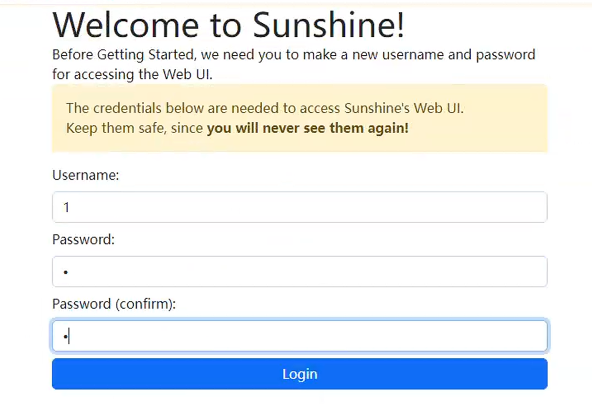
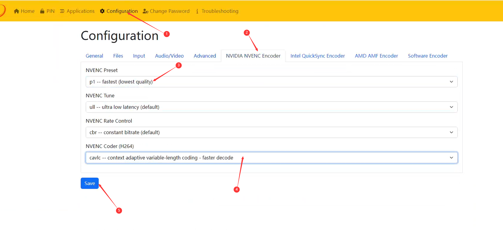
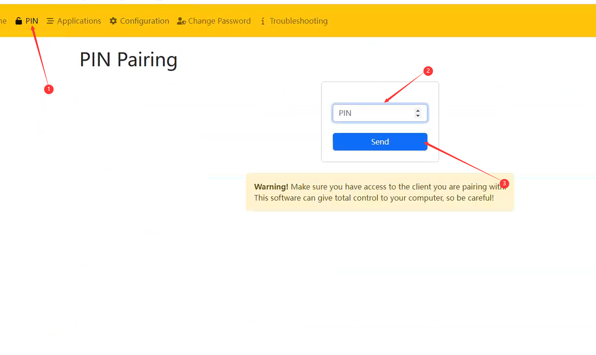

# Moonlight


Download & Install Moonlight & Sunshine on **Second PC**

* Moonlight -> [Github](https://github.com/moonlight-stream/moonlight-qt/releases) (Download & Install MoontlightSetup.exe)\
  Click Next and Next until the installation complete.



Download & Install Moonlight & Sunshine on **Main PC**

* Sunshine -> [Github](https://github.com/LizardByte/Sunshine/releases) (Show all Assets -> Download & Install sunshine-windows-installer.exe)\
  Click Next and Next until the installation complete.


## Moonlight Setup 

1. On **Second PC**, open Moonlight -> Settings Page:
   1. Set to Borderless Windows Mode.
   2. Enable Vertical Sync.
2. Back to Main Page, click the desktop icon in the list.
3. Remember the 4 digits PIN number.
4. Run Browser -> Open `https://localhost:47990/` page. (Must use Edge Browser)
5. It will pop up `NET::ERR_CERT_AUTHORITY_INVALID` Error, click Advanced -> Continue.
6. You will now loaded into Sunshine Setup page.


It's recommended to set all the information to 1, easy remember



7. Configure the settings as Image below:

<figure><figcaption></figcaption></figure>

8. After click Save, goto PIN page and fill the 4 digits PIN number you get on Step 3. Click Send.

<figure><figcaption></figcaption></figure>

9. The **Second PC** moonlight's desktop icon doesn't show locked means it's done.

<figure><figcaption></figcaption></figure>

10. Click the Desktop Icon to start the broadcast

***

## How to exit broadcast moonlight 


On Second PC keyboard press `Ctrl+Shift+Alt+Q` together to exit the broadcast moonlight.

