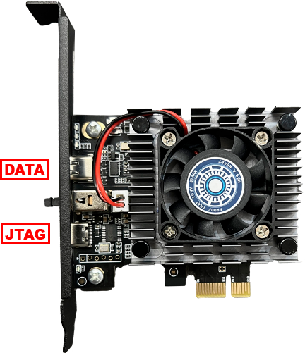
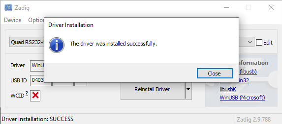
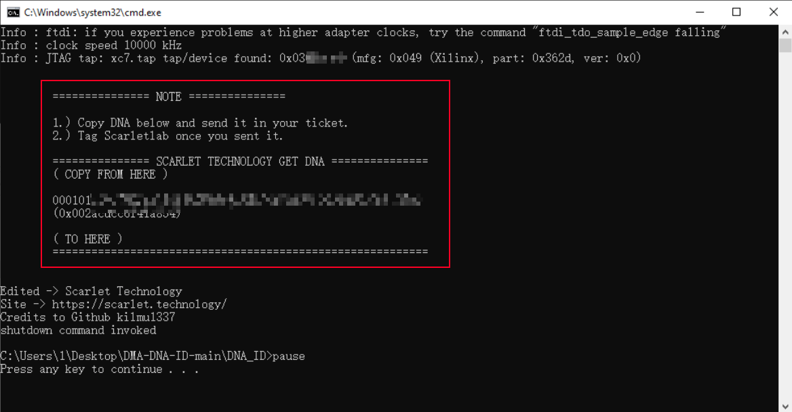

# Get DMA ID Manual (New Method)


Download & Extract Toolset

[https://alist.scarlet.technology/d/Tools/DNA\_ID.zip?sign=vuf3WnCBzIxn6lB9pEeAf8n4A1mycZEHfnsIMCzrm\_U=:0](https://alist.scarlet.technology/d/Tools/DNA_ID.zip?sign=vuf3WnCBzIxn6lB9pEeAf8n4A1mycZEHfnsIMCzrm_U=:0)



Reminder

* Please completely uninstall the anti-cheat software running at startup before dumping the device list. (Vanguard, Faceit, ACE, 5E, Wanmei, etc.)
* All operations are performed on the **Second PC**.


***

## 1. Switch the port on DMA to JTAG 


The port closest to the gold finger is the **JTAG** port, while the one farthest from it is the **DATA** port.


<figure><figcaption></figcaption></figure>

***

## 2. Download & Install driver for JTAG


Firmware Flasher Tools Pack\
-> [**\[Click to Download\]**](https://alist.scarlet.technology/d/Users/Tools/DMA_Flasher.zip)



Your DMA are either [#i.-rs232-dma-driver-leetdma-captaindma-others](get-dma-id-manual-new-method.md#i.-rs232-dma-driver-leetdma-captaindma-others "mention") or [#ii.-ch347-dma-driver-scartletdma-captaindma-peeperdma-hackdma-and-others](get-dma-id-manual-new-method.md#ii.-ch347-dma-driver-scartletdma-captaindma-peeperdma-hackdma-and-others "mention").

Try both if you don't know which one you are.


### I. RS232 DMA Driver (LeetDMA, CaptainDMA, Others)

1. Download the tools above and extract. Open <mark style="color:blue;">**`Drivers`**</mark> folder -> Run <mark style="color:red;">**`zadiag.exe`**</mark>
2. Click **Options** -> **List All Devices**

<figure><figcaption></figcaption></figure>

3. On USB Device, Choose <mark style="color:red;">**`Quad RS232-HS(Interface 0)`**</mark>


You must select “Interface 0", otherwise it is likely to cause DMA damage.



Can't find the device? Double check your dma is plugged to JTAG port or try [ch347-dma-burning.md](firmware-burning-manual/ch347-dma-burning.md "mention")


<figure><figcaption></figcaption></figure>

4. Press **"Replace Driver"** or **"Install Driver"** and wait until the driver installed, installation take up to 5 minutes.

<figure><figcaption></figcaption></figure>

<figure><figcaption></figcaption></figure>

<figure><figcaption></figcaption></figure>


After successfully, close the zadiag and goto next step.


***

### II. CH347 DMA Driver (ScartletDMA, CaptainDMA, PeeperDMA, Hackdma and Others)

1. Download the tools above and extract. Open <mark style="color:blue;">**`Drivers`**</mark> folder -> Open <mark style="color:blue;">**`CH341PAR`**</mark> -> Open <mark style="color:blue;">**CH341PAR**</mark> -> Run & Install <mark style="color:red;">**`SETUP.exe`**</mark>


Can't find the device? Double check your dma is plugged to JTAG port or try [#i.-rs232-dma-driver](get-dma-id-manual-new-method.md#i.-rs232-dma-driver "mention")


***

## 3. Get DNA / DMA ID

1. Based on your DMA board type (35T / 75T), run the corresponding .bat file


If you're unsure whether to choose <mark style="color:red;">**`CH347`**</mark> or <mark style="color:red;">**`RS232`**</mark>, just run both; one of them will display the ID.


<figure><figcaption></figcaption></figure>

2. This is how the correct results looks like ⬇️

<figure><figcaption></figcaption></figure>

3. Copy the ID and send in your ticket. After that tag Scarletlab for firmware produce.
