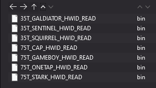
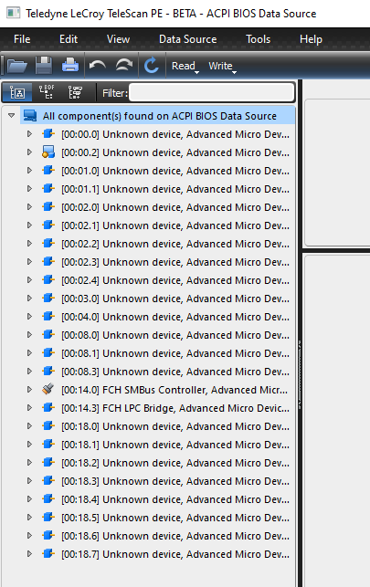
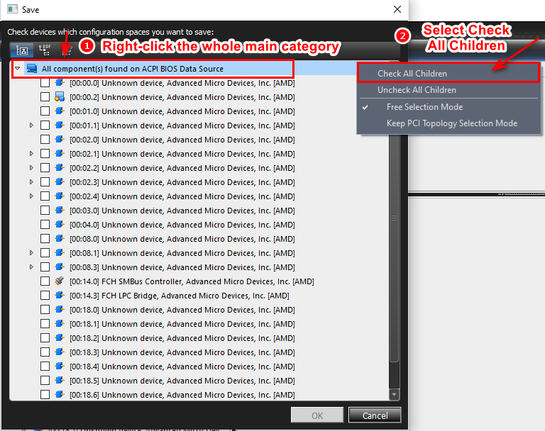
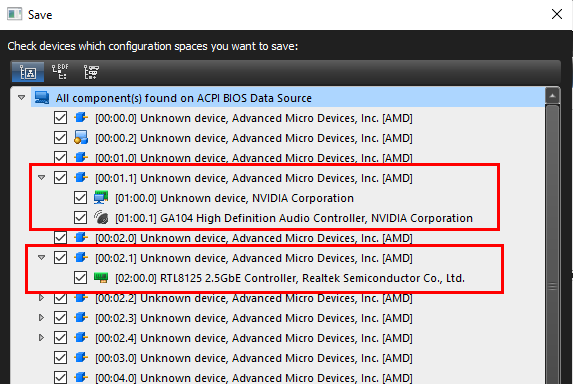

# Get DMA ID Manual (Old Method)


Download & Extract Read ID Firmware

[https://alist.scarlet.technology/d/Tools/Scarlet-Peeper-READ.zip?sign=il62wHQ7qYXSetWTT5DiLTT8NjjPvGfl-439N6EN0Yk=:0](https://alist.scarlet.technology/d/Tools/Scarlet-Peeper-READ.zip?sign=il62wHQ7qYXSetWTT5DiLTT8NjjPvGfl-439N6EN0Yk=:0)



Download Telescan Tools

From our Drive -> [Telescan Tools](https://alist.scarlet.technology/d/Tools/telescan_pe_v1.54.zip?sign=W7ir8jZ-2LWjAF2zjIJbiRbcOCzFmh0aOAU3vzuLpBE=:0)\
OR Download from their Official -> [Telescan Tools](https://www.teledynelecroy.com/protocolanalyzer/pci-express/telescan-pe-software/resources/analysis-software)


> Extract, Install and Run **TeleScanSW1.54\_B0006\_BETA.exe**


Please completely uninstall the anti-cheat software running at startup before dumping the device list. (Vanguard, Faceit, ACE, 5E, Wanmei, etc.


***

## » Flash the Read ID Firmware 


All actions here should complete on **Second PC**.


<figure><figcaption></figcaption></figure>

1. Follow the guideline based on your DMA board.\
   (ask in ticket if you don't know which board type you have)\
   (SQUIRREL references most 35T boards)


**Flash the Read ID Firmware into your DMA board**

[Click me For Instruction](firmware-burning-manual/)


2. After successfully burned the Read ID firmware into your DMA, Restart twice your main PC and go to next step.

***

## » Steps to Dump the Devices List


All actions here should complete on <mark style="color:red;">**Main PC**</mark>.


<figure><figcaption></figcaption></figure>

1. Press **`CTRL+S`**, right click **`All Component(s)`**`*`\` and choose `Check All Children`

<figure><figcaption></figcaption></figure>

2. Double confirm all the sub-children also ticked

<figure><figcaption></figcaption></figure>

3. Click **`OK`**, save the file name format as `TicketName-OrderID-BoardBrand-35T/75T.tlscan.`\
   Example: Ticket0000-1234-StarkDMA-35T.tlscan


After successfully saving the file, it's recommended completely uninstall this software.

