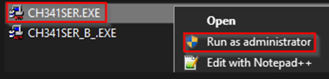
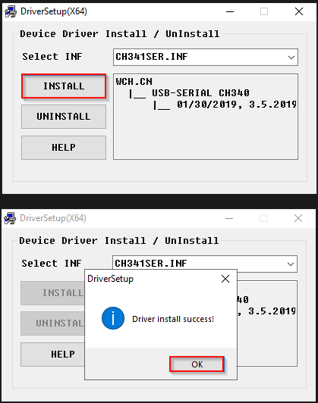
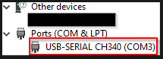
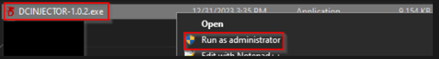
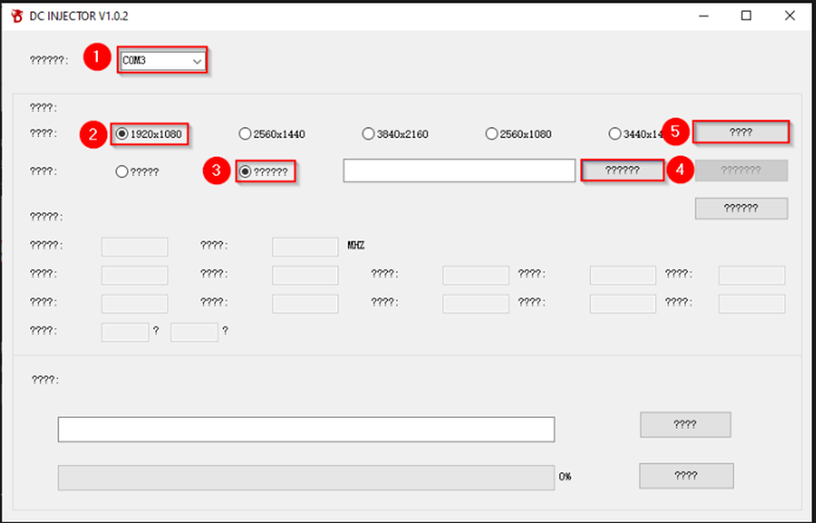
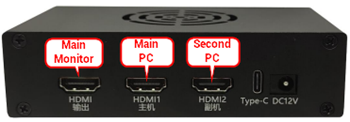
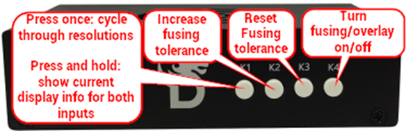
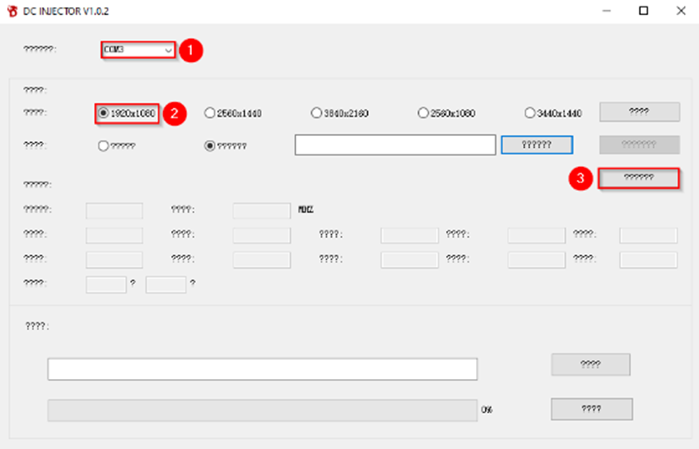

# P1 \[4K@165]


Toolset Download Link

[https://alist.scarlet.technology/Fuser](https://alist.scarlet.technology/Fuser)


***

## » What to prepare

* A <mark style="color:red;">**Main PC**</mark> with an HDMI port, capable of outputting the required resolution and refresh rate.
* A <mark style="color:red;">**Second PC**</mark> with an HDMI port, capable of outputting the required resolution and refresh rate.
* 1 HDMI + 2 DP cables, capable of outputting the required resolution and refresh rate.


**Before diving into the official installation tutorial, there are some essential information that you need to be aware of.**

1. The resolution inputted in the fuser must be same. (The refresh rate can be different.)
   * For example, if the main PC inputs 1080p 240Hz and the second PC inputs 1080p 60Hz, the output result will cause the ESP rendering overlay to run at only 60fps. As a result, the ESP rendering overlay will appear laggy.


***

## » P1's Information

### Wiring Instructions

<table data-header-hidden><thead><tr><th width="251"></th><th></th></tr></thead><tbody><tr><td>DC-12V</td><td>Power Adapter</td></tr><tr><td>USB-C</td><td>Type-C Cable (USB 2.0)</td></tr><tr><td>Overlay</td><td>Second PC HDMI</td></tr><tr><td>Main</td><td>Main PC DP</td></tr><tr><td>Monitor</td><td>Ouput DP -> Input DP into your Main Monitor</td></tr></tbody></table>

<figure><figcaption></figcaption></figure>

### Display Information

| Parameter                 | Option 1                       | Option 2                      | Option 3                        | Option 4                   |
| ------------------------- | ------------------------------ | ----------------------------- | ------------------------------- | -------------------------- |
| Display (Mode)            | 
Mix (Fuse

)
       | M Only (Display Only Main PC) | O Only (Display Only Second PC) | PIP1-4 (Not Yet Implement) |
| Mix TH (Cutout Intensity) | 0 to 250 (Every 10 is a scale) | -                             | -                               | -                          |
| PIP Size                  | 1/2                            | 1/3                           | 1/4                             | -                          |
| Backlight                 | 10s                            | 30s                           | 50s                             | On (Always On)             |

***

## » Setup Instruction

1. Before powering on the fuser, you need to connect the power cable, the display DP cable, the host DP cable, and the auxiliary HDMI cable (the HDMI cable can also be connected with a slight delay).
2. Press the power button and wait until the red light turns to blue and remains solid, indicating that it is in normal working condition. After waiting for a few seconds, the monitor should be able to display the picture, and at the same time, you need to observe whether the display information on the small screen is displayed, and whether the information of the two input ports is displayed.
3. Select the desired refresh rate on the primary and secondary units, and theoretically select the highest option in the list.
4. The rotary knob is used to switch to the next option, and the rotary knob is pressed to confirm. There are the following four parameters to set, when the white cursor is in the setting, the parameters can be set, and the knob will return to the red cursor when you press the knob to confirm.

***

## » Configuration

### ➀ Configure on Operating System

On both PC's: - Like we did before, navigate to "Display settings" and change your resolution / refresh rate to the same desired value (If you see one PC can be set to 240hz and the other PC can only be set to 239.97hz, don't worry.)

### ➁ Configure Fuser

There are 3 Ports on the fuser. Grab your 3 HDMI cables and plug them in as follows:

* \[HDMI] goes to the main monitor.
* \[HDMI1] goes to main PC.
* \[HDMI2] goes to second PC.

<figure><figcaption></figcaption></figure>

Once everything is plugged in, all lights should be on.


**Meaning of each indicators**

* D1 = Power indicator. If the light is on it has power
* D2 = Fusing/Overlay status. If the light is on it means the fuser is overlaying the second PC's output
* H2 = Second PC input status. If the light is on then it means the fuser is getting a signal from the second PC.
* H1 = Main PC input status. If the light is on then it means the fuser is getting a signal from the main PC.
*

    <figure><figcaption></figcaption></figure>

    **Each button has a function:**

    * K1 = Press it once: cycle through resolutions. It should default on 1080p. Press the button to cycle until you reach your desired resolution.\
      Press and hold: Show current input information like resolution and refresh rate.
    * K2 = Increase the fusing strength/tolerance. The higher it goes, the more of the gray it will delete during fusing.
    * K3 = Resets the fusing strength/tolerance to default. This is what I use. It works nicely for every cheat I've tried.
    * K4 = Toggle fusing/overlay.
    *

        <figure><figcaption></figcaption></figure>


***

## » Run your DMA Cheats

1. This is pretty straightforward. I just press K4 turn off overlay, then when you're ready to cheat press K4 again to access your second PC's display.
2. Run your cheat
3. Find "Fuser Mode" or similar in your cheats menu and enable it (some automatically have it enabled)

***

## » NOTES

### ➀ Multiple Monitors

If you want, you can plug in multiple monitors to your second PC. For the easiest usage:

* Make sure your main display is the fuser
* Make sure the display mode is "Extended"
* Then when you cheat, just make sure you drag your fuser ESP window to your fuser

### ➁ Reset the Fuser

If you want to reset the fuser back to factory setting (you might do this if your EDID isn't working and you've exhausted all options), just plug the fuser back in via the USB-C to USB-A cable and do this:

1. Select the correct COM port.
2. Select the desired resolution.
3. Click the third button.

<figure><figcaption></figcaption></figure>


<mark style="color:red;">**`All actions here to be done on Main PC !!!`**</mark>


* Grab your USB-C to USB-A cable.
* Plug in USB-C end to your fuser; USB-A end into your Main PC.

<figure><figcaption></figcaption></figure>

* Search "Device Manager" in your windows search bar and open it

<figure><figcaption></figcaption></figure>

* It should looks like this under "Ports (COM & LPT)". If it does, skip and goto Step 3

<figure><figcaption></figcaption></figure>

* If it doesn't and show as "USB Serial", complete "Driver Install":

<figure><figcaption></figcaption></figure>


<mark style="color:red;">**`Driver Installation`**</mark>&#x20;

1. Download the CH340 driver zip [**HERE**](https://alist.scarlet.technology/Fuser) and save it wherever you'd like.
2. Extract the folder and open the extracted folder
3. Right click the "CH341SER.EXE" and click "Run as administrator"

&#x20;                                          

4. Click "INSTALL" and then "OK"

&#x20;                                          \

5. Now go back to "Device Manager" and you should see your fuser show up under Ports (COM & LPT)
6. Take note of the COM port it's on. For example, mine's on COM3 (if you have multiple COM ports showing, just unplug your fuser and see which one dissapears, then re-plug it in)

&#x20;                                           


***

### Inject EDID

* Download the EDID program [HERE](http://77.37.62.144:8111/hardware-other-instruction/fuser-instruction/)
* Save it wherever you'd like and right click it and click "Run as administrator"

<figure><figcaption></figcaption></figure>

1. Select the correct COM port.
2. Select your desired resolution. For example, I want 1920x1080.
3. Click that button (it's the automatic easier injection).
4. Click that button to browse your files and select the .bin you saved earlier.
5. Click that button to inject.

<figure><figcaption></figcaption></figure>

* You'll see some random characters pop up, that's fine. Close the dialog boxes and you can close all previously used applications and windows
* Unplug your USB-C to USB-A cable from the Main PC.

***

## » Configuration

### Configure Fuser

There are 3 Ports on the fuser. Grab your 3 HDMI cables and plug them in as follows:

* \[HDMI] goes to the main monitor.
* \[HDMI1] goes to main PC.
* \[HDMI2] goes to second PC.

<figure><figcaption></figcaption></figure>

Once everything is plugged in, all lights should be on.


**`Meaning of each indicators`**

* D1 = Power indicator. If the light is on it has power
* D2 = Fusing/Overlay status. If the light is on it means the fuser is overlaying the second PC's output
* H2 = Second PC input status. If the light is on then it means the fuser is getting a signal from the second PC.
* H1 = Main PC input status. If the light is on then it means the fuser is getting a signal from the main PC.\

&#x20;                                          .png>)\

Each button has a function:

* K1 = Press it once: cycle through resolutions. It should default on 1080p. Press the button to cycle until you reach your desired resolution.\
  Press and hold: Show current input information like resolution and refresh rate.
* K2 = Increase the fusing strength/tolerance. The higher it goes, the more of the gray it will delete during fusing.
* K3 = Resets the fusing strength/tolerance to default. This is what I use. It works nicely for every cheat I've tried.
* K4 = Toggle fusing/overlay

&#x20;                                           


### Configure on Operating System 

On both PC's: - Like we did before, navigate to "Display settings" and change your resolution / refresh rate to the same desired value (If you see one PC can be set to 240hz and the other PC can only be set to 239.97hz, don't worry.)

***

## » Run your DMA Cheats 

1. This is pretty straightforward. I just press K4 turn off overlay, then when you're ready to cheat press K4 again to access your second PC's display.
2. Run your cheat
3. Find "Fuser Mode" or similar in your cheats menu and enable it (some automatically have it enabled)

***

## » NOTES: 

### Multiple Monitors 

If you want, you can plug in multiple monitors to your second PC. For the easiest usage:

* Make sure your main display is the fuser
* Make sure the display mode is "Extended"
* Then when you cheat, just make sure you drag your fuser ESP window to your fuser

### Reset the Fuser 

If you want to reset the fuser back to factory setting (you might do this if your EDID isn't working and you've exhausted all options), just plug the fuser back in via the USB-C to USB-A cable and do this:

1. Select the correct COM port.
2. Select the desired resolution.
3. Click the third button.

<figure><figcaption></figcaption></figure>
