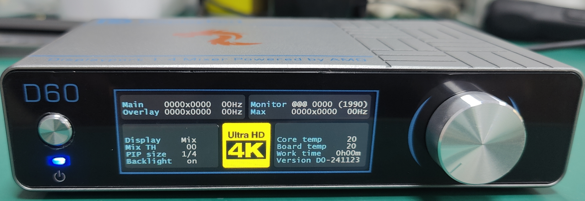

# Setup Instruction

### <mark style="color:red;">Product Interface</mark>

<figure><figcaption>
Front Side
</figcaption></figure>

<figure><figcaption>
Back Side
</figcaption></figure>

***

### <mark style="color:red;">Product Wiring Instruction Table</mark>

| DC-12V  | Transformer       |
| ------- | ----------------- |
| USB-C   | Type C (USB 2.0)  |
| OVERLAY | Second PC HDMI    |
| MAIN    | Main PC DP        |
| MONITOR | Monitor output DP |

### <mark style="color:red;">Monitor Fuser Display</mark>

<figure><figcaption></figcaption></figure>

<table><thead><tr><th></th><th width="140">Option 1</th><th>Option 2</th><th>Option 3</th><th>Option 4</th></tr></thead><tbody><tr><td>Display Mode</td><td>Mix (both)</td><td>M only (Only Main PC)</td><td>O Only (Only 2nd PC)</td><td>PIP-4 (Not available yet)</td></tr><tr><td>Image Intensity (Threshold)</td><td>0-250 for every scale</td><td>0-250 for every scale</td><td>0-250 for every scale</td><td>0-250 for every scale</td></tr><tr><td>Window Size in Picture</td><td>1/2</td><td>1/3</td><td>1/3</td><td>-</td></tr><tr><td>Backlight Duration</td><td>10s</td><td>30s</td><td>50s</td><td>Keep On</td></tr></tbody></table>

***

### <mark style="color:red;">Proper Way to Use Fuser</mark>

<mark style="color:red;">**Step 1:**</mark>\
Before powering on the fuser, make sure to connect the power cable, monitor DP cable, main unit DP cable, and sub-unit HDMI cable (you can connect the HDMI cable later if needed).

<mark style="color:red;">**Step 2:**</mark>\
Press the power button. When the red light turns blue and stays solid, the fuser is in normal working mode. After a few seconds, the monitor should display an image. Check the small screen to ensure the monitor information is shown, and both input ports are displayed.

<mark style="color:red;">**Step 3:**</mark>\
Set the desired refresh rate on both the main unit and the sub-unit. Ideally, select the highest option available from the list.

<mark style="color:red;">**Step 4:**</mark>\
Use the rotary knob to switch to the next option and press the knob to confirm. There are four parameters you can adjust. When the white cursor is active, you can change the settings. After pressing the knob to confirm, it will return to the red cursor.

### <mark style="color:red;">Fuser Error Indicators</mark>

1. **No light after pressing the power button:**\
   &#xNAN;_&#x50;ossible Cause:_ Hardware issue with the board or power adapter problem.
2. **Red light turns off after pressing the power button:**\
   &#xNAN;_&#x50;ossible Cause:_ Hardware issue.
3. **Red light turns blue and blinks after pressing the power button:**\
   &#xNAN;_&#x50;ossible Cause:_ Hardware issue.
4. **Red light turns green and blinks after pressing the power button:**\
   &#xNAN;_&#x50;ossible Cause:_ Not activated or a random error.

***

### <mark style="color:red;">Firmware Upgrade Steps</mark>

**Step 1:**\
Before powering on the fuser, connect the Type-C data cable and power cable (make sure the CH340 driver is installed on the debugging computer; it’s recommended to use the sub-unit for debugging).

**Step 2:**\
Press the power button, and within one second after the red light turns on, press the button on the left of the front panel. The indicator will remain red, indicating the fuser is in firmware upgrade mode.

**Step 3:**\
Use the firmware upgrade tool to select the correct bin file for the update. Wait a few minutes for the process to complete, then power off the device.
