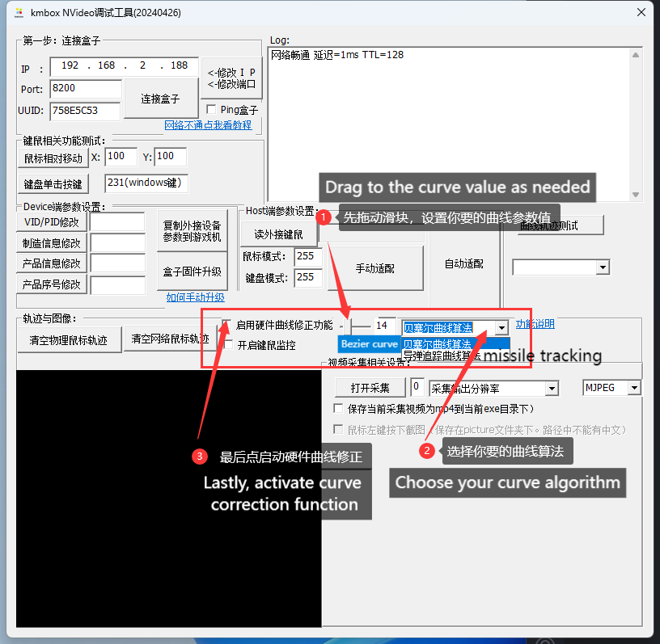

# How to customize your kmbox curve


This function allows a smoother mouse trajectory, free of unwanted glitches, teleportation and pauses. By default, the curve function is turned off.


***

## ➀ Download Tools

#### » [\[Click me to download Upgrade Tools\]](https://alist.scarlet.technology/d/Users/Tools/kmboxNet_UpgradeTools.zip) «

***

## ➁ Open Software for controlling host PC

<figure><figcaption></figcaption></figure>


If failed, please refer to Beginner's Guide to make sure your net is ok before connecting again



If successful, choose curve values and types of algorithm. (Make sure to follow the instructions below closely.&#x20;


<figure><figcaption></figcaption></figure>

The display should be as the following after activation of the curve algorithm.

<figure><figcaption></figcaption></figure>

&#x20;                                                                                     &#x20;
