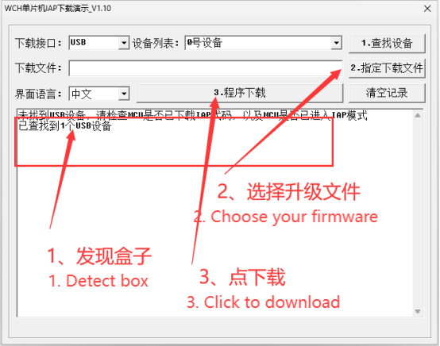

# How to Upgrade Firmware


<mark style="color:red;">**Do not upgrade**</mark> your firmware if your box was <mark style="color:yellow;">**not activated before 2024.8.31**</mark>;

Normal upgrading is supported if your box was <mark style="color:yellow;">**activated before 2024.8.31**</mark>.



There will be newly upgraded firmware each month for B+ version to fix known bugs and improve keyboard and mouse features accordingly. You are recommended to download the latest firmware.


***

## &#x20;➀ Download Tools & Firmware

#### » [\[Click me to download Upgrade Tools\]](https://alist.scarlet.technology/d/Users/Tools/kmboxNet_UpgradeTools.zip) «

#### » [\[Click me to get Firmware List\]](https://alist.scarlet.technology/Firmware/Kmbox%20Net) «

***

## ➁ Upgrade your firmware


Please follow the instructions closely. Make sure your COM number is correct. Try another PC if all failed.


1. Unplug all the USB cables to disconnect the box.
2. Press down the only button inside the box and hold.
3. Plug in the USB cable to the port (Gaming PC) while holding the previous button. You will then see   the indicator light blink fast. Now let go of the button.
4. Open the upgrade tool WCHMcuIAP\_WinAPP.exe (Double click)

<figure><figcaption></figcaption></figure>


Choose the one you would like to upgrade then click download.


5. If download is successful, the box will reboot automatically. Display is normal at this point

<figure><figcaption></figcaption></figure>


If failed, retry the above instructions

